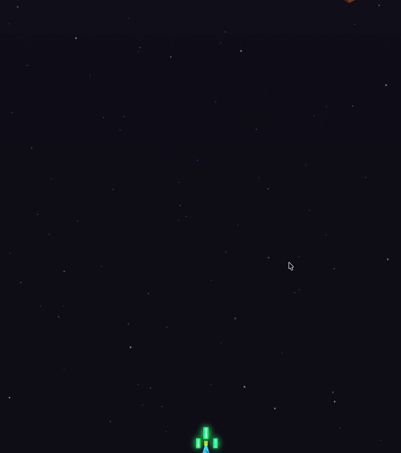
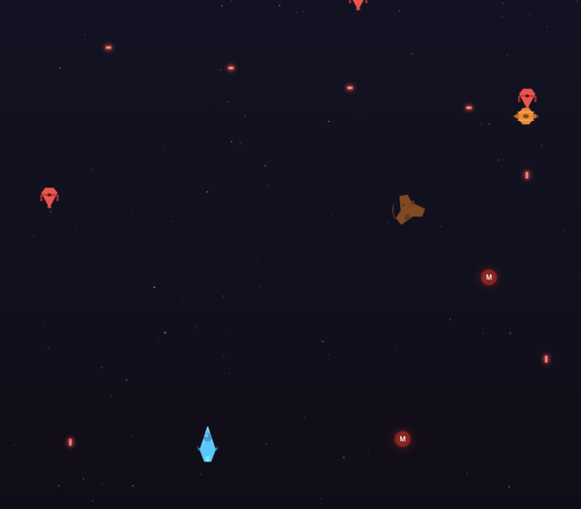
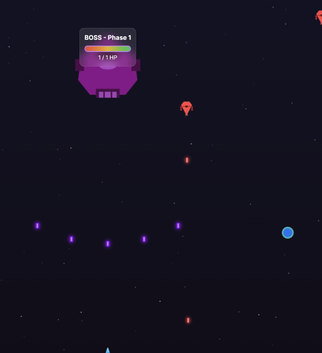
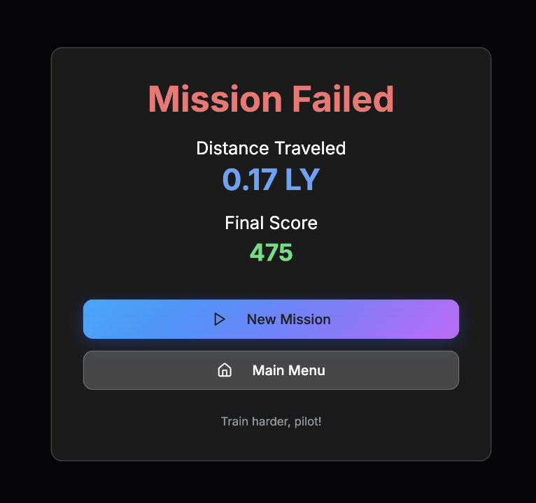

# 🚀 Cosmic Drift



**Cosmic Drift** is a fast-paced space survival game where you pilot a lone spaceship through an endless asteroid field while battling waves of enemies and powerful bosses.

Your mission: **survive as long as possible and travel further than any pilot before you.**

---

## 🎮 Gameplay

You start your journey with **3 lives** and must navigate through deep space while destroying enemies and avoiding hazards.

The further you travel, the more intense the action becomes.

⚡ **Boss battles begin after travelling 1 Light Year.**

Once defeated, another boss will appear **every additional Light Year**.

---

## 🧠 Game Mechanics

### Lives
- You start with **3 lives**
- Losing all lives ends the mission

### Distance
- Distance is measured in **Light Years (LY)**
- Boss encounters trigger every **1 LY**

### Enemies
Enemies spawn continuously as you travel through space.

Some enemies shoot back, while others try to collide with your ship.

---

## ⚡ Power Ups

Power ups spawn randomly and can drastically change your survival chances.

### 🌀 Orbiting Rods
Three spinning rods orbit your ship and:
- Destroy enemies on contact
- Protect you from incoming threats

### 🛡 Shield
Temporary invincibility for a few seconds.

You cannot take damage while shielded.

### 🚀 Missiles
Powerful weapon that can wipe out enemies instantly.

### ❤️ Extra Life
Grants **+1 life**.

---

## 🎮 Controls

| Key | Action |
|----|----|
| **Arrow Keys / Movement Controls** | Move the spaceship |
| **Spacebar** | Fire laser |
| **M** | Fire missile |

---

## 📸 Screenshots

### Gameplay


### Boss Battle


### Game Over Screen


*(Replace these with your actual screenshot filenames)*

---

## 🛠 Running the Game

This project uses **Vite + React + TypeScript**.

### 1️⃣ Install dependencies

```bash
npm install 


### 2️⃣ Start the development server

```bash
npm run dev
```

### 3️⃣ Open in your browser

After starting the development server, open:

```
http://localhost:5173
```

The game will launch in your browser.

---

## 🏗 Build for Production

To create an optimized production build:

```bash
npm run build
```

To preview the production build locally:

```bash
npm run preview
```

---

## 🤝 Contributing

Contributions are **welcome and encouraged**.

If you would like to improve Cosmic Drift:

1. Fork the repository
2. Create a feature branch

```bash
git checkout -b feature/your-feature
```

3. Make your changes
4. Commit your work

```bash
git commit -m "Add some feature"
```

5. Push to your fork

```bash
git push origin feature/your-feature
```

6. Open a **Pull Request**

Suggestions for improvements include:

- New enemy types  
- Additional bosses  
- New power-ups  
- Improved visual effects  
- Sound design improvements  
- Mobile controls  
- Leaderboards  
- Difficulty scaling  

All constructive improvements are welcome.

---

## 💡 Future Ideas

Possible future additions:

- Online high score leaderboard  
- Additional boss types  
- New weapon systems  
- Cooperative multiplayer  
- Procedural enemy waves  
- Expanded soundtrack and sound effects  

---

## ⭐ Support the Project

If you enjoy the game, consider giving the repository a **star ⭐** on GitHub.  
It helps others discover the project and encourages further development.

---

## 👨‍🚀 Author

Created by **Patrick Hackman**